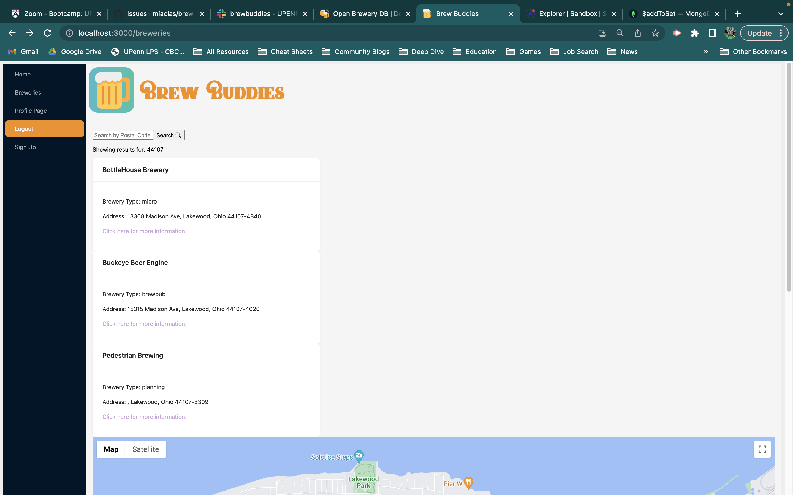
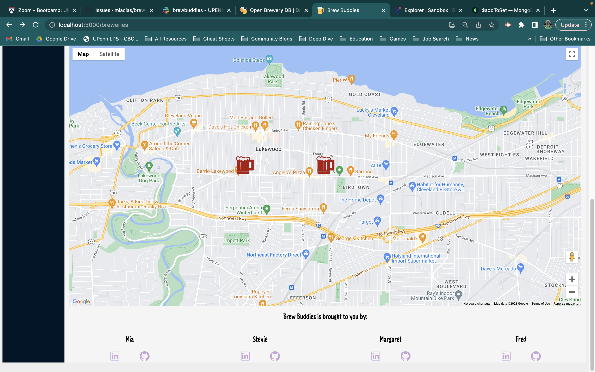

# Brew Buddies

## Description

Brew Buddies is a hybrid review site and social media for lovers of beer, breweries, barley, and buddies. This application allows you to search nearby breweries and see user reviews, or take up a pen (so to speak) and write your own! You can also add breweries to your Favorites list, so no matter how good a time you have, you'll never forget your favorite hangout hops spots. If a review catches your eye, save it to your favorites so you can try it next Saturday night. You can also add Friends, who you might want to share a pint with. The site display is as fresh and fun as your favorite distillery pull. Please drink responsibly! Cheers! 🍻

## Table of Contents

- [Installation](#installation)
- [Usage](#usage)
- [Contributors](#contributors)
- [Roadmap](#roadmap)
- [Credits](#credits)
- [Technologies](#technologies)
- [License](#license)
- [Features](#features)
- [Screenshots](#screenshots)

## Installation

No installation required! [Deployed link here.](https://fierce-basin-42875.herokuapp.com/)

## Usage

The landing page of the website presents a list of recent brewery reviews. For full functionality, a user with have to sign up and login. Once logged in, users can search breweries by postal code and is presented with a list of breweries in that area and a map display with their locations. A user can click on any brewery's link to see its page. It will display the brewery info, as well as any available reviews and its average star rating. A user can click on the "Add to Favorites" button to save a list of breweries. They can also add a review of their own. Users can also add another user as a friend to see their reviews or favorites. Please see below for screenshots!

## Contributors

- Mia Ciasullo
~ [GitHub](https://github.com/miacias)
~ [LinkedIn](https://www.linkedin.com/in/miaciasullo)

- Stevie O'Connell
~ [GitHub](https://github.com/OConnell-Coder)
~ [LinkedIn](https://www.linkedin.com/in/stephanie-o-connell-965051274)

- Margaret Saylor
~ [GitHub](https://github.com/msaylorphila)
~ [LinkedIn](https://www.linkedin.com/in/margaret-saylor)

- Fred Chang
~ [GitHub](https://github.com/LearnedDr)
~ [LinkedIn](https://www.linkedin.com/in/fredrick-chang-85987672)

## Roadmap

Content will be added and adjusted as new coding projects are available! Some projects may phase out over time as contrubitors' work becomes more specialized.
1. user experience:
    - users can save breweries to their wishlist for future travels and exploration
2. site quality:
    - add validators on sign up for birthdate (ages 21 and up!)
    - display total number of reviews and average rating on single brewery page
    - custom Ant Design Theme using craco
    - maximize homepage OpenBreweryDB API call and incorporate pagination
3. future feature(s): 
    - cocktails
      - search cocktail recipes with names, ingredients, and instructions through api-ninjas.com/api/cocktail
      - users can save favorite cocktail recipes
      - users can save custom cocktails
    - interaction
      - user actions save to profile feed where friends can add "likes" and/or "comments"
      - add geolocation tools to promote local micro breweries, distilleries, etc.

## Credits

Documentation referenced:

- [OpenBreweryDB API](https://www.openbrewerydb.org/)
- [MongoDB](https://www.mongodb.com/docs/manual/)
- [Mongoose](https://mongoosejs.com/docs/)
- [Google Maps React Wrapper](https://github.com/googlemaps/react-wrapper/tree/main) - load Google Maps with React
- [GranimJS](https://sarcadass.github.io/granim.js/examples.html) - animated color gradients
- Mozilla Developer Network (MDN)
- Stack Overflow Forums
- W3 Schools

U. Penn Bootcamp instructor(s): 

- [Dan Gross](https://github.com/DanielWGross) - Set()
- [Andrew Hojnowski](https://github.com/aHojo) - defined preliminary MVP
- [C. Ross King](https://github.com/RomeoKilo125/) - why to reset DB after model changes

Tutor(s): 

- Alexis San Javier [GitHub](https://github.com/code-guy21)
  - making use of client-side auth utils and storing in state variable
  - rendering user review to Single Brewery page

Tutorials referenced:

- [Tim Mousk](https://timmousk.com/blog/react-get-element-by-id/) - get element by ID with React useEffect

Artist(s):

- "keep thirsty" palette by [torryster](https://www.colourlovers.com/palette/3364323/keep_thirsty)
- [Twitter Twemoji](https://github.com/twitter/twemoji) - favicon, Copyright 2020 Twitter, Inc and other contributors
  - Graphics Source: [1f37a.svg](https://github.com/twitter/twemoji/blob/master/assets/svg/1f37a.svg)
  - Graphics License: [CC-BY 4.0](https://creativecommons.org/licenses/by/4.0/)
- font(s)
  - [GuarGum](https://www.cdnfonts.com/g-guargum.font) - by Wahyu Eka Prasetya
  - [Braton Composer Stamp Rough](https://www.cdnfonts.com/braton-composer-stamp-rough.font) - [Alit Suarnegara](https://alitdesign.net/)
  - [Winter Danced](https://www.cdnfonts.com/winter-danced.font) - [Iwan Kristiaman Nazara, Jasman Nazara, Situjuh Nazara](https://7ntypes.com)

## Technologies & Tools used:

- [VS Code](https://code.visualstudio.com/)
- React
- GraphQL, [Node.js](https://nodejs.org/en/), Express.js, Apollo
- MongoDB, Mongoose
- Bcrypt, JWT, Dotenv
- Ant Design, Granim.js
- BSON
- Heroku
- Google Maps API
- Open Brewery DB API

## License

Please refer to the LICENSE in the repo:

## Features

- Search breweries by postal code
- See user reviews on each brewery
- Write a review with a star rating
- Add breweries to a favorites list
- Add and remove friends
- View user profiles with their reviews

## Screenshots

